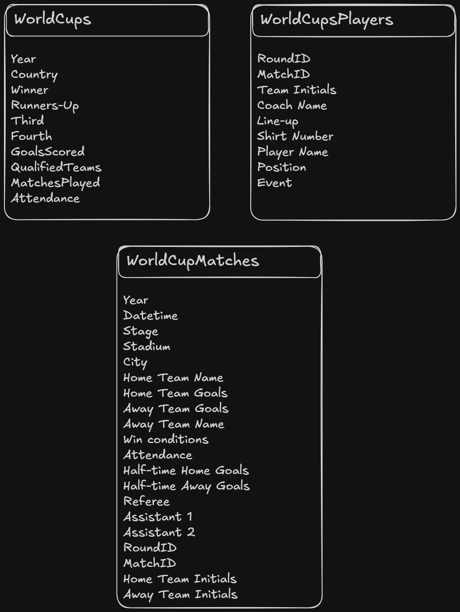
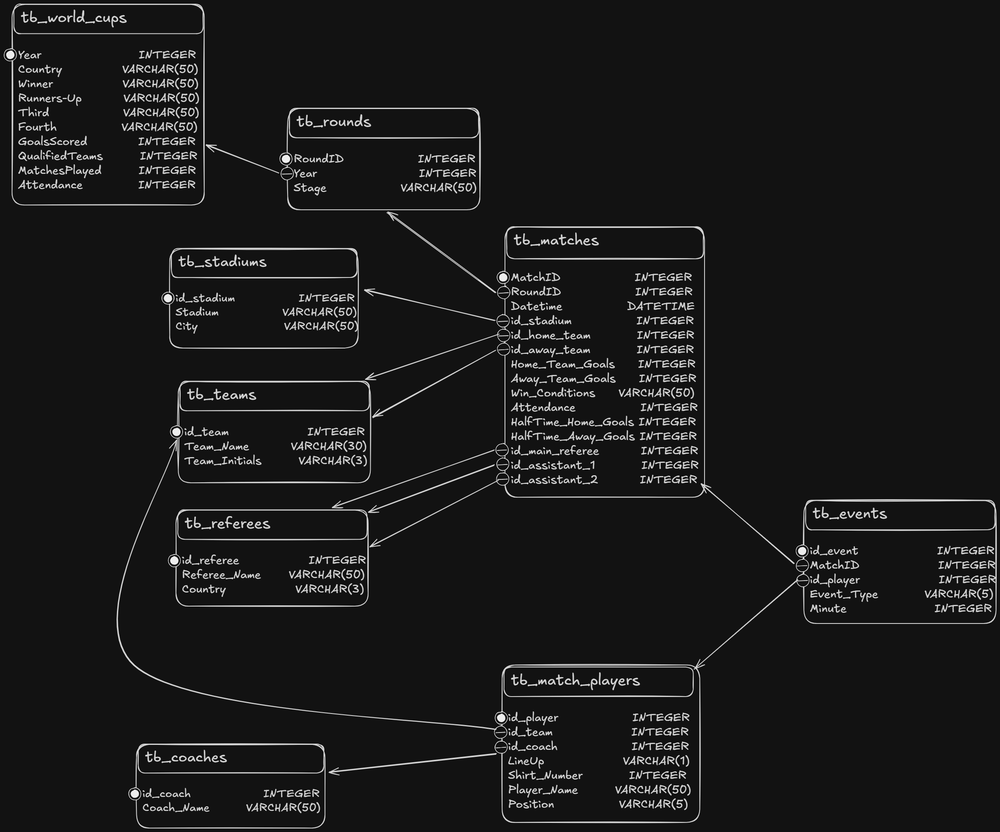

# ⚽ Projeto: Organização e Análise dos Dados da Copa do Mundo

## 📌 Contexto Inicial

Este projeto foi desenvolvido para a disciplina de Banco de Dados com o objetivo de aplicar engenharia reversa em um dataset denormalizado da Copa do Mundo da FIFA (1930-2014), originalmente em formato CSV. 

O grande desafio do arquivo original era a alta redundância e a mistura de informações na mesma tabela (como nomes de estádios, cidades, árbitros e gols repetidos textualmente em milhares de linhas). Para resolver isso, os dados brutos foram limpos, divididos e estruturados em um banco de dados relacional SQLite, aplicando rigorosamente as Três Formas Normais (1FN, 2FN e 3FN).

---

## 📐 O Antes e o Depois: Como os dados foram organizados

Abaixo está a explicação de como cada estrutura problemática do dataset original foi corrigida e organizada no novo banco de dados:

### 🔄 Tabela Comparativa de Estruturas

| O que estava desorganizado (Antes no CSV) | Como foi estruturado (Depois no Banco SQL) | Justificativa Técnica (Normalização) |
| :--- | :--- | :--- |
| **Nomes e Países juntos:** Os árbitros vinham com a sigla do país colada no nome em uma única string (ex: `LOMBARDI Domingo (URU)`). | **Tabelas Separadas:** Criamos a tabela `tb_referees` onde o nome do árbitro e a sigla da sua nacionalidade ficam em colunas atômicas separadas. | **1ª Forma Normal (Atomicidade):** Garante que cada coluna armazene apenas um valor lógico indivisível por registro. |
| **Eventos amontoados:** Todos os gols e eventos de um jogador ficavam aglomerados em um único texto na mesma linha (ex: `G40' G87'`). | **Linha por Gol:** Criamos a tabela fato de eventos `tb_events`. Agora, cada gol do campeonato gera uma linha exclusiva no banco. | **1ª Forma Normal (Eliminação de Grupos Repetidos):** Permite realizar contagens e agregações matemáticas diretamente via SQL (como `COUNT` e `SUM`). |
| **Estádios e Cidades repetidos:** O nome do estádio e a sua cidade se repetiam textualmente em cada nova partida armazenada. | **Dimensão de Estádios:** Criamos a tabela `tb_stadiums`. A tabela de partidas agora apenas referencia o código `id_stadium`. | **2ª Forma Normal (Dependência Parcial):** Os dados do estádio e da cidade dependem do local em si, e não da partida diretamente. |
| **Identificação dos Confrontos:** Os jogos registravam apenas os nomes textuais dos times (ex: "Brazil"), propício a erros de digitação. | **Chaves Estrangeiras Duplas:** Criamos a tabela `tb_teams` e inserimos duas chaves estrangeiras distintas na tabela de jogos: `id_home_team` e `id_away_team`. | **2ª e 3ª Forma Normal (Integridade Referencial):** Centraliza o cadastro das seleções, padroniza a escrita e economiza espaço de armazenamento. |
| **Fases e Anos duplicados:** O nome da fase (ex: "Final") e o ano da copa se repetiam em todas as linhas de partidas daquela etapa. | **Tabela de Rodadas:** Criamos a tabela `tb_rounds`. A partida agora aponta apenas para o `RoundID`, que por sua vez se conecta ao ano da Copa. | **3ª Forma Normal (Dependência Transitiva):** Uma partida pertence a uma rodada, e a rodada pertence a um ano. Isolar essa relação elimina a redundância na tabela fato. |

---

## 🗺️ Visualização do Modelo
Abaixo podes comparar a evolução da modelagem do projeto, desde os dados brutos até ao banco de dados final otimizado:

### Cenário Original (Denormalizado - Kaggle)

### Esquema Relacional Otimizado (3ª Forma Normal)

